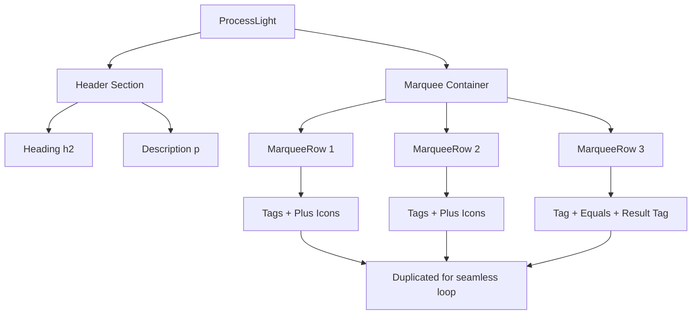

# Design Document: ProcessLight Component

## Overview

Компонент ProcessLight представляет собой светлую версию секции процесса работы с горизонтально прокручивающимися тегами (marquee-эффект). Компонент будет размещен после существующей секции Process и будет использовать CSS-анимации для создания бесконечной прокрутки тегов.

## Architecture

```
app/
├── components/
│   └── ProcessLight.tsx    # Новый компонент
└── page.tsx                # Добавить ProcessLight после Process
```

Компонент будет использовать:
- React с TypeScript
- Framer Motion для анимаций появления
- CSS keyframes для marquee-эффекта
- Tailwind CSS для стилизации

## Components and Interfaces

### ProcessLight Component

```typescript
interface ProcessLightProps {
  className?: string
}

const ProcessLight: React.FC<ProcessLightProps> = ({ className }) => {
  // Component implementation
}
```

### Tag Component (внутренний)

```typescript
interface TagProps {
  text: string
  variant?: 'default' | 'result'
}
```

### MarqueeRow Component (внутренний)

```typescript
interface MarqueeRowProps {
  items: Array<{ type: 'tag' | 'plus' | 'equals', text?: string }>
  speed?: number
  direction?: 'left' | 'right'
}
```

## Data Models

### Process Steps Data

```typescript
const row1Items = [
  { type: 'tag', text: 'ТЗ' },
  { type: 'plus' },
  { type: 'tag', text: 'брифинг' },
  { type: 'plus' },
  { type: 'tag', text: 'аналитика' },
  { type: 'plus' },
  { type: 'tag', text: 'roadmap' },
  { type: 'plus' },
]

const row2Items = [
  { type: 'tag', text: 'прозрачный процесс работы' },
  { type: 'plus' },
  { type: 'tag', text: 'коммуникация' },
  { type: 'plus' },
]

const row3Items = [
  { type: 'tag', text: 'осознанность команды' },
  { type: 'equals' },
  { type: 'result', text: 'уверенность в результате' },
]
```

## Visual Design

### Color Scheme

| Element | Color |
|---------|-------|
| Background | `#f5f5f5` (light gray) |
| Heading | `#1a1a1a` (dark) |
| Description | `#6b7280` (gray-500) |
| Tag background | `#ffffff` (white) |
| Tag border | `#e5e7eb` (gray-200) |
| Tag text | `#1a1a1a` (dark) |
| Plus/Equals icon bg | `#4F46E5` (accent blue) |
| Plus/Equals icon text | `#ffffff` (white) |
| Result tag bg | `#4F46E5` (accent blue) |
| Result tag text | `#ffffff` (white) |

### Typography

- Heading: `druk-font`, `text-4xl sm:text-5xl lg:text-6xl`, `font-black`
- Description: `text-lg sm:text-xl`, `text-gray-500`
- Tags: `druk-font`, `text-lg sm:text-xl`, `font-medium`

### Spacing

- Section padding: `py-16 sm:py-20 px-4 sm:px-6 lg:px-8`
- Content max-width: `max-w-6xl mx-auto`
- Gap between rows: `gap-4 sm:gap-6`
- Tag padding: `px-6 sm:px-8 py-3 sm:py-4`
- Icon size: `w-10 h-10 sm:w-12 sm:h-12`

## Marquee Animation

### CSS Keyframes

```css
@keyframes marquee {
  0% {
    transform: translateX(0);
  }
  100% {
    transform: translateX(-50%);
  }
}

@keyframes marquee-reverse {
  0% {
    transform: translateX(-50%);
  }
  100% {
    transform: translateX(0);
  }
}
```

### Animation Implementation

Каждый ряд будет содержать дублированный контент для создания бесшовной прокрутки:

```
[items][items] -> анимация translateX(-50%) создает бесконечный цикл
```

Скорости анимации:
- Row 1: 30s (медленная)
- Row 2: 25s (средняя)
- Row 3: 35s (медленная, обратное направление)

## Responsive Behavior

### Desktop (>= 1024px)
- Полноразмерные теги и иконки
- Три ряда marquee с полной шириной

### Tablet (640px - 1023px)
- Уменьшенные размеры шрифтов
- Сохранение marquee-эффекта

### Mobile (< 640px)
- Компактные теги
- Меньшие иконки (w-8 h-8)
- Уменьшенный заголовок (text-3xl)
- Marquee продолжает работать

## Error Handling

- Компонент не имеет внешних зависимостей данных
- Все данные статичны и определены внутри компонента
- CSS-анимации работают без JavaScript после загрузки

## Testing Strategy

### Visual Testing
- Проверка отображения на разных размерах экрана
- Проверка плавности marquee-анимации
- Проверка цветовой схемы и контрастности

### Functional Testing
- Проверка корректного рендеринга всех тегов
- Проверка бесшовности анимации (без прыжков)
- Проверка hover-эффектов (если применимо)

## Component Structure Diagram



## Integration

Компонент будет добавлен в `app/page.tsx` после компонента `Process`:

```tsx
<Process />
<ProcessLight />
<ServicesPricing />
```
